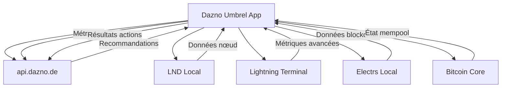

# 🌐 TOPOLOGIE COMPLÈTE API - DAZNO UMBREL APP

## 📊 OVERVIEW

Cette application utilise **exclusivement** l'API externe `api.dazno.de` pour obtenir des recommandations d'optimisation ROI. Toutes les autres données proviennent des services Umbrel locaux.

## 🔌 CLIENT MCP - API.DAZNO.DE

### Configuration
```rust
// Base URL configurée
MCP_API_URL = "https://api.dazno.de"

// Client principal
pub struct MCPClient {
    client: reqwest::Client,
    base_url: String,           // https://api.dazno.de
    api_key: Option<String>,    // Bearer token optionnel
}
```

## 📋 ENDPOINTS API.DAZNO.DE UTILISÉS

### 1. 🏥 HEALTH CHECK
```http
GET https://api.dazno.de/api/v1/health
```
**Fonction:** `health_check()`  
**Usage:** Vérification de la disponibilité de l'API  
**Auth:** Non requis  
**Retour:** `200 OK` si service disponible

---

### 2. 📈 RECOMMANDATIONS
```http
GET https://api.dazno.de/api/v1/recommendations/{node_pubkey}
```
**Fonction:** `get_recommendations(node_pubkey: &str)`  
**Usage:** Obtenir les recommandations d'optimisation ROI  
**Auth:** Bearer token optionnel  
**Paramètres:**
- `{node_pubkey}` - Clé publique du nœud Lightning (66 chars hex)

**Réponse:**
```json
[
  {
    "id": "rec_001",
    "action_type": "AdjustFees",
    "priority": "High",
    "expected_roi_impact": 3.2,
    "parameters": {
      "channel_id": "123456789",
      "new_fee_rate": 500
    },
    "created_at": "2024-01-15T10:30:00Z",
    "description": "Optimize fees on high-traffic channel"
  }
]
```

---

### 3. 📊 SOUMISSION RÉSULTATS D'ACTION
```http
POST https://api.dazno.de/api/v1/actions/result
```
**Fonction:** `submit_action_result(result: ActionResult)`  
**Usage:** Rapporter le résultat d'une action exécutée  
**Auth:** Bearer token optionnel

**Payload:**
```json
{
  "action_id": "action_123",
  "success": true,
  "message": "Channel fees adjusted successfully",
  "timestamp": "2024-01-15T10:35:00Z"
}
```

---

### 4. 📊 MÉTRIQUES NŒUD
```http
POST https://api.dazno.de/api/v1/metrics
```
**Fonction:** `submit_node_metrics(metrics: NodeMetrics)`  
**Usage:** Envoyer les métriques du nœud pour analyse  
**Auth:** Bearer token optionnel

**Payload:**
```json
{
  "pubkey": "02a1b2c3d4e5f6...",
  "alias": "Lightning Node",
  "channels": [
    {
      "channel_id": "123456789",
      "peer_pubkey": "03fedcba...",
      "capacity": 1000000,
      "local_balance": 500000,
      "remote_balance": 500000,
      "fees_earned": 1000,
      "forwards_count": 50,
      "uptime_percentage": 99.5
    }
  ],
  "wallet_balance": 2000000,
  "channel_balance": 5000000,
  "total_capacity": 10000000,
  "routing_fees_earned": 50000,
  "timestamp": "2024-01-15T10:00:00Z"
}
```

---

### 5. 📈 ANALYSE DE PERFORMANCE
```http
GET https://api.dazno.de/api/v1/analysis/{node_pubkey}/performance?days={timeframe_days}
```
**Fonction:** `get_performance_analysis(node_pubkey: &str, timeframe_days: u32)`  
**Usage:** Obtenir une analyse détaillée des performances  
**Auth:** Bearer token optionnel  
**Paramètres:**
- `{node_pubkey}` - Clé publique du nœud
- `days` - Période d'analyse (ex: 30)

**Réponse:**
```json
{
  "roi_trend": "positive",
  "efficiency_score": 87.5,
  "recommendations_count": 12,
  "avg_response_time": 145,
  "performance_vs_network": 15.3,
  "prediction_accuracy": 94.7,
  "insights": [
    {
      "type": "fee_optimization",
      "impact": "high",
      "description": "Optimize fees on 3 high-traffic channels"
    }
  ]
}
```

## 🏗️ ENDPOINTS SUPPOSÉS (SELON SPECS)

### 6. 🔬 ANALYSE AVANCÉE
```http
POST https://api.dazno.de/api/v1/analyze/advanced
```
**Usage théorique:** Analyse ML avancée avec données complètes  
**Status:** Mentionné dans specs mais non implémenté

### 7. 🏆 ANALYSE CONCURRENTIELLE
```http
GET https://api.dazno.de/api/v1/competitive/analysis
```
**Usage théorique:** Comparaison avec nœuds concurrents  
**Status:** Mentionné dans specs mais non implémenté

## 🔀 FLUX DE DONNÉES



## 🔧 FONCTIONS PAR ENDPOINT

| Endpoint | Fonction Rust | Usage Principal | Auth |
|----------|---------------|-----------------|------|
| `/api/v1/health` | `health_check()` | Monitoring service | ❌ |
| `/api/v1/recommendations/{pubkey}` | `get_recommendations()` | Récupérer recommandations | ⚠️ |
| `/api/v1/actions/result` | `submit_action_result()` | Rapporter résultats | ⚠️ |
| `/api/v1/metrics` | `submit_node_metrics()` | Envoyer métriques | ⚠️ |
| `/api/v1/analysis/{pubkey}/performance` | `get_performance_analysis()` | Analyse performance | ⚠️ |

**Légende:** ❌ = Pas d'auth, ⚠️ = Auth optionnelle

## 🚀 UTILISATION DANS L'APPLICATION

### Initialisation
```rust
// main.rs:44-49
let mcp_api_url = std::env::var("MCP_API_URL")
    .unwrap_or_else(|_| "https://api.dazno.de".to_string());
let mcp_client = MCPClient::new(mcp_api_url, None);
```

### Intégration endpoints locaux
L'application expose ses propres endpoints qui utilisent le client MCP :

- `GET /api/recommendations` → `mcp_client.get_recommendations()`
- `POST /api/actions` → `mcp_client.submit_action_result()`
- Monitoring via WebSocket pour données temps réel

## 🧪 TESTS ET MOCKING

### Mock Server
```rust
// tests/mock_api_server.rs
// Simule api.dazno.de pour tests offline
```

### Tests d'intégration
- `integration_tests.rs` - Tests avec vraie API
- `performance_tests.rs` - Tests de charge
- `mock_api_server.rs` - Tests offline

## ⚡ OPTIMISATIONS IMPLÉMENTÉES

1. **Client réutilisable** - Une seule instance partagée
2. **Gestion d'erreurs** - Fallback gracieux si API indisponible
3. **Timeout configurables** - Éviter blocages
4. **Tests complets** - Mock + intégration réelle
5. **Logging détaillé** - Debugging facilité

## 🔒 SÉCURITÉ API

- **HTTPS obligatoire** - Chiffrement transport
- **Auth optionnelle** - Bearer tokens supportés
- **Rate limiting client** - Protection surcharge
- **Validation entrées** - Sécurisation parameters
- **Secrets Docker** - Configuration sécurisée

## 📊 MÉTRIQUES & MONITORING

### Métriques collectées
- Latence appels API
- Taux de succès/échec
- Nombre recommandations reçues
- Performance actions exécutées

### Logs de debugging
```rust
info!("Fetching recommendations from MCP: {}", url);
warn!("MCP API returned status: {}", response.status());
error!("Failed to submit action result: {}", response.status());
```

---

**⚡ RÉSUMÉ**: Cette application utilise `api.dazno.de` **uniquement** pour les recommandations d'optimisation ROI. Toutes les autres données (nœud, canaux, blockchain) proviennent des services Umbrel locaux pour garantir la sécurité et la confidentialité des fonds Lightning Network.